# 🤵 Бот для игры в классическую мафию 🖤
Автоматизированный ведущий для игр в классическую мафию

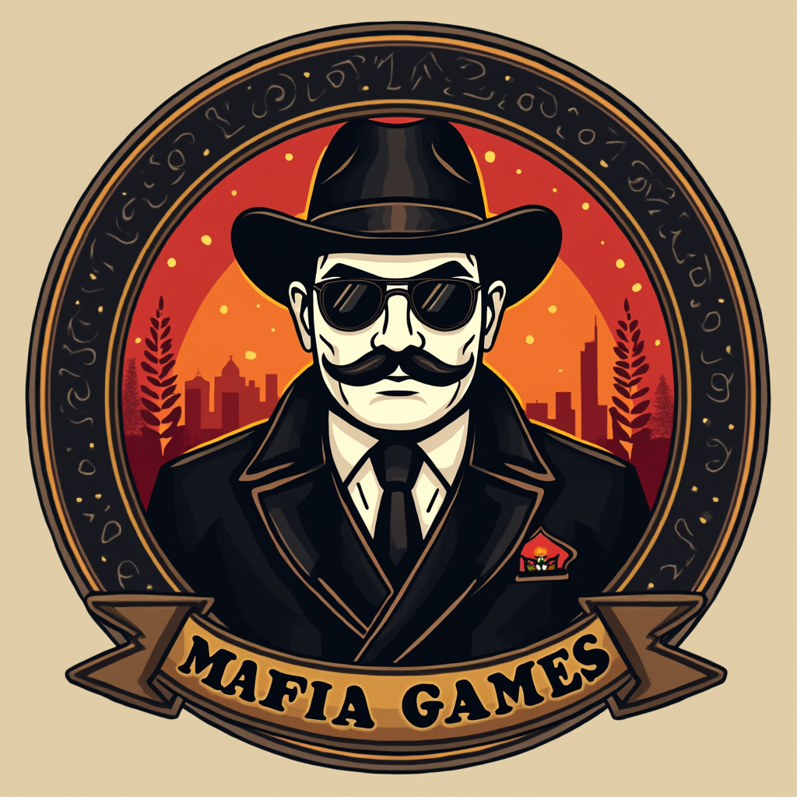

## 📌Оглавление

1. 📝 [Описание проекта](https://github.com/Xadrikore/Mafia-bot-preview?tab=readme-ov-file#-описание-проекта)
2. 🔧 [Основные функции](https://github.com/Xadrikore/Mafia-bot-preview?tab=readme-ov-file#-основные-функции)
3. ⚙️ [Команды бота](https://github.com/Xadrikore/Mafia-bot-preview?tab=readme-ov-file#-команды-бота)
4. 📜 [Правила игры](https://github.com/Xadrikore/Mafia-bot-preview?tab=readme-ov-file#-правила-игры)
5. 🎬 [Пример использования](https://github.com/Xadrikore/Mafia-bot-preview?tab=readme-ov-file#-пример-использования)
6. 📷 [Скриншоты](https://github.com/Xadrikore/Mafia-bot-preview?tab=readme-ov-file#-скриншоты)
7. 📞 [Контакты](https://github.com/Xadrikore/Mafia-bot-preview?tab=readme-ov-file#-контакты)

## 📝 Описание проекта
### 
🎉 Добро пожаловать в мир интриг, обмана и стратегии! 🎉

&nbsp;&nbsp;&nbsp;&nbsp;Этот бот — ваш идеальный помощник для проведения захватывающих игр в классическую мафию на 10 человек 🕵️. С ним вы сможете забыть о рутине и полностью погрузиться в атмосферу игры. Бот берет на себя всю организацию: от распределения ролей до управления таймерами и голосованием. Просто добавьте его в чат, и пусть игра начнется!

## 🔧 Основные функции

>"В этом городе бот — ваш главный шериф. Он следит за порядком, управляет игрой и гарантирует, что правила соблюдаются. Никто не сможет обмануть систему, пока бот на страже!"

### 1. Хостинг игры 🎮
*"Бот берет на себя роль ведущего, чтобы вы могли сосредоточиться на игре."*

- Создаёт новую игру и управляет её жизненным циклом 🎲
- Распределяет роли между игроками: **мафия** 🤵, **шериф** 🤠 и **мирные жители** 🧑
- Автоматически начинает игру, когда все участники готовы ⏳

---

### 2. Слежение за действиями 🕶️
*"Ночью город спит, но бот не дремлет. Он видит всё."*

- Управляет этапами игры: **ночь**, **день**, **обсуждение**, **голосование**.
- Следит за действиями игроков:
  - 🤵 **Мафия** выбирает жертву
  - 🤠 **Шериф** проверяет роли
- Фиксирует все события в логах для прозрачности

---

### 3. Объявление победы 🏆
*"Когда игра подходит к концу, бот объявляет, кто вышел победителем в этой схватке."*

- Автоматически определяет победителя:
    🩸 **Мафия** побеждает, если устраняет всех мирных жителей 🩸 
    🎉 **Мирные жители** побеждают, если вычисляют всю мафию 🎉
- Показывает итоговую статистику:
  - Кто кого устранил
  - Кто голосовал и за кого
  - Как развивались события

---

### 4. Контроль за соблюдением правил ⚖️
*"В этом городе правила — закон. Бот следит за их выполнением."*

- Контролирует честность игры:
  - Не позволяет игрокам нарушать правила (например, голосовать дважды) 🚫
  - Пресекает попытки обмана или подтасовки 🕵️‍♂️
- Напоминает игрокам о их ролях и действиях, если они забывают 📢
- Завершает игру, если кто-то нарушает правила слишком часто ⛔

---

### 5. Таймеры и уведомления ⏱️
*"Время — деньги. Бот следит, чтобы каждый этап игры длился ровно столько, сколько нужно."*

⏳ Устанавливает таймеры для каждой фазы 
🔔 Отправляет уведомления о начале и конце каждого этапа

## ⚙️ Команды бота

>"В этом городе бот — ваш главный помощник. Он знает все команды, которые помогут вам управлять игрой, настраивать правила и следить за порядком."

### Основные команды 💬

| Команда           | Действие                                      | Описание                                                                 |
|-------------------|-----------------------------------------------|-------------------------------------------------------------------------|
| `/start`          | **Запустить бота**                           | Начните взаимодействие с ботом                                         |
| `/new_game`       | **Создать игру**                             | Создайте новую игру в мафию                                            |
| `/start_game`     | **Запустить игру**                           | Начните игру, когда все игроки готовы                                  |
| `/cancel`         | **Остановить игру**                          | Досрочно завершите текущую игру                                       |

---

### Управление аккаунтом 🔐

| Команда           | Действие                                      | Описание                                                                 |
|-------------------|-----------------------------------------------|-------------------------------------------------------------------------|
| `/login`          | **Зайти в аккаунт**                          | Авторизуйтесь для участия в игре                      |
| `/create_login`   | **Создать аккаунт**                          | Создайте аккаунт всем друзьям                             |
| `/logout`         | **Выйти из аккаунта**                        | Завершите текущую сессию                                               |
| `/change_password`| **Сменить пароль**                           | Обновите пароль для вашего аккаунта                                    |

---

### Управление игроками 👥

| Команда           | Действие                                      | Описание                                                                 |
|-------------------|-----------------------------------------------|-------------------------------------------------------------------------|
| `/leave`          | **Исключить игрока**                         | Удалите игрока из текущей игры                                         |
| `/foul`           | **Проставить фол**                           | Назначьте фол игроку за нарушение правил                               |
| `/cancel_foul`    | **Убрать фол**                               | Снимите фол с игрока                                                   |
| `/pass`           | **Пропустить речь**                          | Игрок пропускает свою очередь говорить                                |

---

### Настройки игры 🛠️

| Команда           | Действие                                      | Описание                                                                 |
|-------------------|-----------------------------------------------|-------------------------------------------------------------------------|
| `/settings`       | **Настройки игры**                           | Измените параметры игры (роли, таймеры и т.д.)                         |

## 📜 Правила игры

>"В этом городе правила — не просто слова. Это оружие, которое может спасти или погубить. Ознакомьтесь с официальными правилами Федерации интеллектуальных игр (ФИИМ), чтобы знать, как выжить и победить."

👉 [Официальные правила мафии (ФИИМ)](https://mafiaworldtour.com/fiim-rules)

Помните: в мафии нет места случайностям — только стратегия, хитрость и знание законов. Удачи! 🕶️🎭

## 🎬 Пример использования
>"В этом городе каждый вечер — это битва умов, хитрости и стратегии."

Представьте: вы создали группу в Telegram, добавили бота и начали игру. Вот как это может выглядеть с интерактивными кнопками:

1. **Создание игры**:
   - Вы пишете команду `/new_game`, и бот отправляет сообщение с кнопкой **`Присоединиться`**

2. **Присоединение игроков**:
   - Игроки нажимают кнопку **`Присоединиться`** в сообщении бота
   - Бот автоматически добавляет их в игру и обновляет список участников

3. **Начало игры**:
   - Когда все игроки за столом, ведущий нажимает `/start_game`
   - Бот распределяет роли: **мафия** 🤵, **шериф** 🤠 и **мирные жители** 🧑

4. **Ночь**:
   - Бот отправляет сообщение: ***В городе наступает ночь***
   -
   - Игроки с активными ролями (мафия, доктор, шериф) получают приватные сообщения с кнопками для выполнения своих действий:
     - **Мафия**: Выбрать жертву ⚰️
     - **Шериф**: Проверить роль игрока 🔍

5. **День**:
   - Бот объявляет: ***Город просыпается***
   - Игроки по-очереди обсуждают, кто может быть мафией
   - Бот отправляет сообщение с кнопками для голосования. Каждый игрок выбирает подозреваемого, нажимая на соответствующую кнопку

6. **Голосование**:
   - Бот подсчитывает голоса и объявляет результат: ***Игрок №7 покидает игру***

7. **Победа**:
   - Игра продолжается до тех пор, пока мафия не окажется в большинстве или мирные жители не вычислят всю мафию
   - Бот объявляет победителя: ***Мафия побеждает! Город погрузился во тьму...*** или ***Мирные жители одержали победу! Справедливость восторжествовала!***

## 📷 Скриншоты

  

    <a href="img/printscrean1.jpg" target="_blank">
      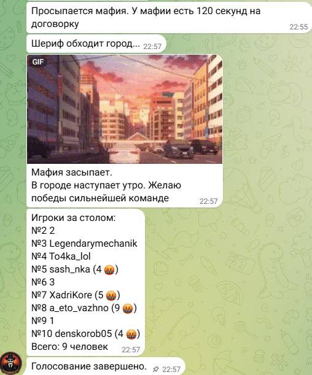
    </a>
    
Скриншот 1

  

  

    <a href="img/printscrean2.jpg" target="_blank">
      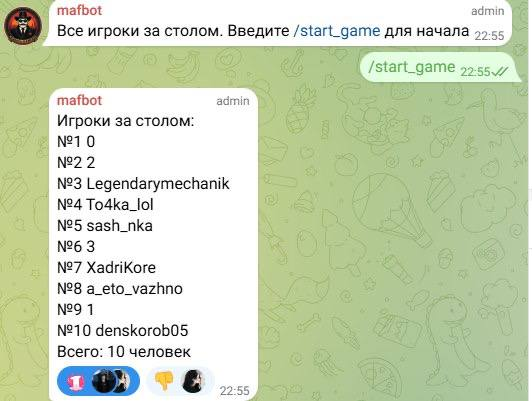
    </a>
    
Скриншот 2

  

  

    <a href="img/printscrean3.jpg" target="_blank">
      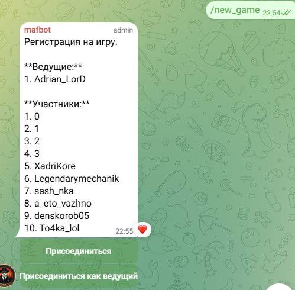
    </a>
    
Скриншот 3

  

  

    <a href="img/printscrean4.jpg" target="_blank">
      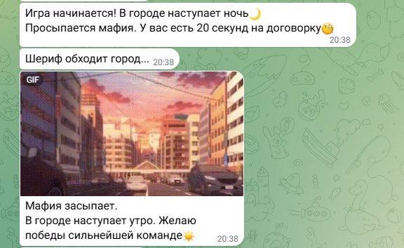
    </a>
    
Скриншот 4

  

  

    <a href="img/printscrean5.jpg" target="_blank">
      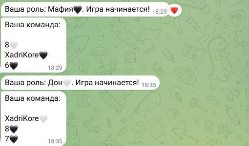
    </a>
    
Скриншот 5

  

  

    <a href="img/printscrean6.jpg" target="_blank">
      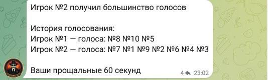
    </a>
    
Скриншот 6

  

  

    <a href="img/printscrean7.jpg" target="_blank">
      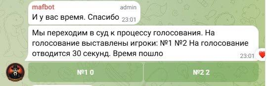
    </a>
    
Скриншот 7

  

  

    <a href="img/printscrean8.jpg" target="_blank">
      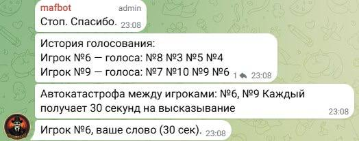
    </a>
    
Скриншот 8

  

  

    <a href="img/printscrean9.jpg" target="_blank">
      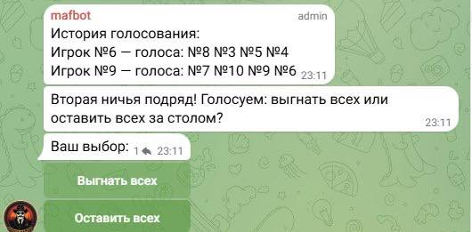
    </a>
    
Скриншот 9

  

  

    <a href="img/printscrean10.jpg" target="_blank">
      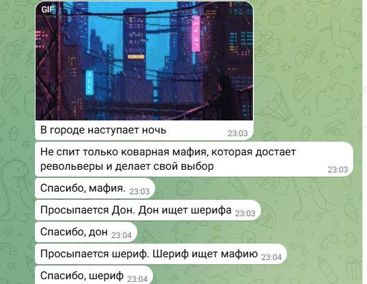
    </a>
    
Скриншот 10

  

  

    <a href="img/printscrean11.jpg" target="_blank">
      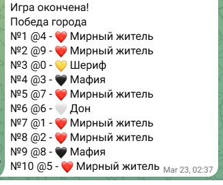
    </a>
    
Скриншот 11

  

  

    <a href="img/printscrean12.jpg" target="_blank">
      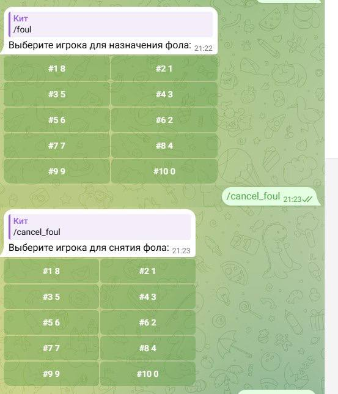
    </a>
    
Скриншот 12

  

## 📞 Контакты

Если у вас есть вопросы, предложения или вы хотите сотрудничать, свяжитесь со мной:

📢 [Telegram](https://t.me/XadriKore) 
💻 [GitHub](https://github.com/Xadrikore)

Я всегда открыт для общения и новых идей! 😊

## 🔒 Доступ к боту

Этот проект находится в закрытом репозитории. Исходный код и доступ к боту ограничены по следующим причинам: 
🔐 Безопасность: Мы заботимся о защите кода и данных пользователей 
🛠️ Поддержка: Закрытый доступ позволяет нам лучше контролировать разработку и обновления 
🤝 Партнерство: Если вы заинтересованы в сотрудничестве, свяжитесь с нами для обсуждения доступа

Если вы хотите получить доступ к боту или узнать больше о проекте, напишите нам: 
👉 [Связаться с разработчиками](#📞-контакты)
